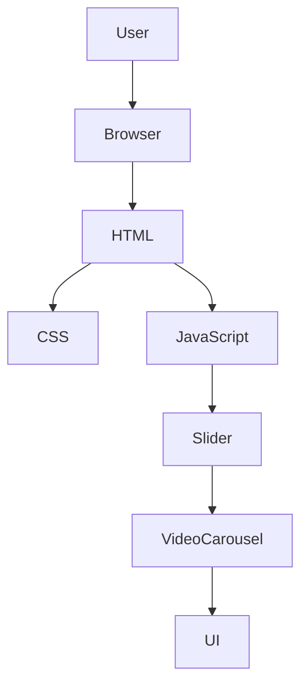

# Porsche 911 GT3 RS – 3D Interactive Showcase

<p align="center">
  
  
  
  
  
</p>

<p align="center">
A modern, immersive landing page inspired by the Porsche 911 GT3 RS, featuring a smooth 3D rotating video carousel, responsive design, and cinematic visual effects built using only HTML, CSS, and vanilla JavaScript.
</p>

---

## 🌐 Live Demo

**🔗 https://porsche-911-gt3-rs.vercel.app/**

---

# 📸 Preview

<p align="center">

</p>

---

# ✨ Features

* ✅ Interactive 3D rotating video carousel
* ✅ Smooth automatic rotation animation
* ✅ Mouse drag support for desktop interaction
* ✅ Touch gesture support for mobile devices
* ✅ Responsive layout for desktop, tablet, and mobile
* ✅ Fullscreen immersive landing page
* ✅ Layered background with overlay effects
* ✅ Porsche-themed typography and visuals
* ✅ Pure HTML, CSS, and JavaScript implementation
* ✅ No external JavaScript libraries

---

# 🛠 Tech Stack

| Category             | Technology                             |
| -------------------- | -------------------------------------- |
| Frontend             | HTML5                                  |
| Styling              | CSS3                                   |
| Programming Language | JavaScript (ES6)                       |
| Animation            | CSS Transform, Perspective, Transition |
| Media                | MP4 Videos, PNG Images                 |
| Fonts                | ICA Rubrik, Poppins                    |
| Deployment           | Vercel (Live Demo)                     |
| Version Control      | Git & GitHub                           |

---

# 📁 Project Structure

```text
Porsche/
│
├── images/
│   ├── Porsche.png
│   ├── bg.png
│   ├── Porsche_911_GT3_RS_10.jpg
│   └── Porsche_911_GT3_RS_FOR_MOBILE.png
│
├── videos/
│   ├── Porsche_1.mp4
│   ├── Porsche_2.mp4
│   ├── ...
│   └── Porsche_10.mp4
│
├── index.html
├── style.css
└── README.md
```

### Folder Overview

| Folder       | Description                                     |
| ------------ | ----------------------------------------------- |
| `images/`    | Backgrounds, favicon, and responsive assets     |
| `videos/`    | Video clips displayed inside the 3D carousel    |
| `index.html` | Main page structure and JavaScript logic        |
| `style.css`  | Styling, animations, responsiveness, and layout |
| `README.md`  | Project documentation                           |

---

# 🏗 Architecture Overview



### Project Flow

1. The browser loads `index.html`.
2. External styles are applied through `style.css`.
3. Ten video elements are rendered inside a circular 3D carousel.
4. JavaScript continuously updates the carousel rotation.
5. Mouse and touch interactions allow manual rotation.
6. Responsive CSS adapts the layout for different screen sizes.

---

# 🚀 Getting Started

## Clone Repository

```bash
git clone https://github.com/varadpensalwar/Porsche.git
```

## Open Project

```bash
cd Porsche
```

Since this is a static website, no installation is required.

Open:

```text
index.html
```

or use any local development server.

Example:

```bash
python -m http.server
```

Then open

```
http://localhost:8000
```

---

# 🎮 Usage

* Open the landing page in your browser.
* Watch the automatic rotating video carousel.
* Drag with your mouse to rotate manually.
* Swipe on mobile devices for touch interaction.
* Enjoy the responsive Porsche showcase.

---

# 📱 Responsive Design

The project includes dedicated layouts for:

* 💻 Desktop
* 📱 Mobile
* 📟 Tablet

Responsive adjustments include:

* Carousel sizing
* Background image switching
* Typography scaling
* Layout spacing

---

# 🎥 Animations

Implemented animations include:

* Continuous carousel rotation
* CSS perspective transforms
* 3D depth effects
* Hover-ready navigation styling
* Smooth transitions
* Drag-based rotation updates

---

# ⚡ Performance

Current optimizations include:

* Hardware-accelerated CSS transforms
* Lightweight vanilla JavaScript
* No external JavaScript libraries
* Responsive image usage
* Video autoplay with looping
* Minimal project structure

---

# 🌍 Browser Support

| Browser | Supported |
| ------- | --------- |
| Chrome  | ✅         |
| Edge    | ✅         |
| Firefox | ✅         |
| Safari  | ✅         |
| Opera   | ✅         |

---

# 📄 Project File Responsibilities

| File         | Responsibility                                         |
| ------------ | ------------------------------------------------------ |
| `index.html` | Page structure, media elements, and interaction logic  |
| `style.css`  | Layout, animations, typography, and responsive styling |
| `README.md`  | Project documentation                                  |

---

# 🚀 Future Improvements

Potential enhancements include:

* Image/video lazy loading
* Keyboard navigation
* Dynamic carousel controls
* Dark/Light theme toggle
* Fullscreen viewing mode
* Audio controls
* Accessibility improvements
* Loading animation
* Performance optimization for lower-end devices

---

# 🤝 Contributing

Contributions are welcome.

If you'd like to improve this project:

1. Fork the repository.
2. Create a new branch.

```bash
git checkout -b feature/your-feature
```

3. Commit your changes.

```bash
git commit -m "Add new feature"
```

4. Push your branch.

```bash
git push origin feature/your-feature
```

5. Open a Pull Request.

---

# 📜 License

This repository currently does **not** include a license.

---

# 👨‍💻 Author

**Varad Pensalwar**

GitHub: https://github.com/varadpensalwar

---

# ⭐ Show Your Support

If you enjoyed this project, consider giving it a ⭐ on GitHub.

It helps support future open-source work and encourages further improvements.
